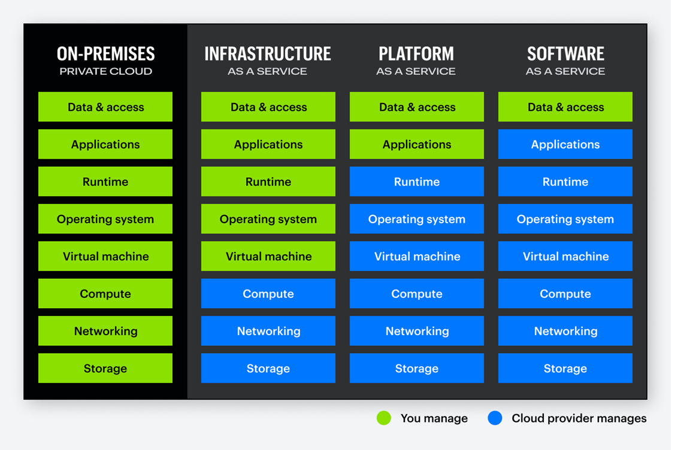
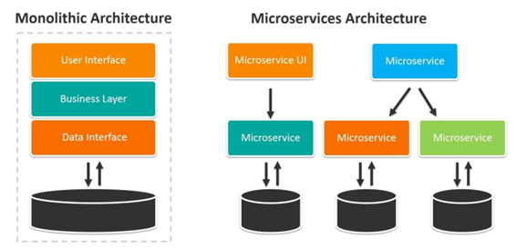
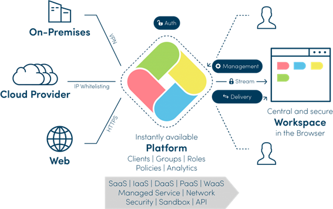
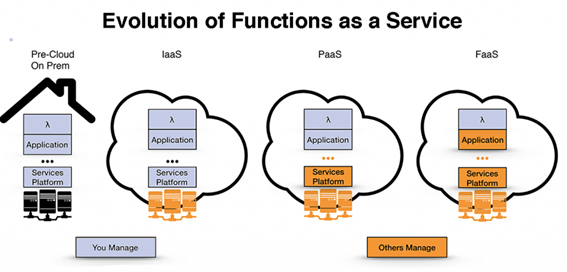

# Estudo FaaS-Function as a Service nas nuvens da Oracle e Huawei

## Histórico de Revisões

|===
| Data | Versão | Autor

| 30/06/2025 | `1.0` | `Joel de Souza Guedes e José de Freitas`
|===


## Criado por:

|===
| DIT/SUAS/DEAT/DAES | Descrição | Representante

| Divisao de Arquitura e Plataformas Estruturantes - DAES | Definição da arquitetura da infraestrutura da empresa | Tiago de Pina Almeida; Tel.:(21) 3616-8057; E-mail: tiago.pina@dataprev.gov.br
|===

= I.   Sobre Function as a Service (FaaS)

== Introdução

Certamente já ouvimos falar em infraestrutura proprietária on-premis, ou modelos SaaS, PaaS e IaaS, mas e modelo FaaS (Function as a Service) ? Estas siglas tratam de Modelos de compartilhamento de responsabilidades conforme o contrato de cliente e provedor de nuvem. 

O conhecido quadro abaixo resume essa divisão de responsabilidades contratadas junto ao provedor nos tipos IaaS (Infraestruture as Service), PaaS (Platform as a Service) e SaaS (Service as a Service)



Em adição aos modelos acima, o FaaS (Function as a Service) pode ser compreendido como um subconjunto do ecossistema de computação sem servidor (Serverless). O conceito de "funções como serviço" (FaaS) é central na computação serverless, onde pedaços de código são executados em resposta a eventos, como requisições HTTP ou mensagens de fila.

Há diversos benefícios na computação em nuvem (Segurança e eficiência são destaques de benefícios inerentes à nuvem). FaaS contempla vantagens como simplificação da infraestrutura para o time de desenvolvimento e inegavelmente o custo é uma vantagem bem atraente, pois é animador pensar em pagar somente pelos recursos realmente demandados pela aplicação (contemplando a carga em picos de alta e baixa demandas de consumo).

Segundo a Allied Market Research, o consumo de FaaS aumentará a uma Taxa de Crescimento Anual Composto de 29,7% de 2020 a 2026. Com o mercado FaaS crescendo rapidamente, é seguro afirmar que o FaaS é um grande negócio.

FaaS está relacionado à esteira DevOps, com o desenvolvimento ligado à melhoria contínua das aplicações. FaaS é escalável, proporciona produtividade e desempenho, um time-to-market mais rápido para aplicativos e uma maneira econômica de produzir novos aplicativos.

Ao contrário do SaaS, não há milhares de players de nuvem fornecedores de FaaS. A grande maioria dos FaaS utiliza soluções (frameworks) nativos dos principais provedores de nuvem do mercado, há ainda soluções para nuvens diversas usando frameworks externos e plugins não nativos.

O modelo FaaS abrange conceitos adicionais (para mais informações acesse os links contidas nas Referências deste documento), tais como:

* Fn Project - Framework open source, nativa em contêineres, pode ser usado em qualquer provedor de nuvem ou on-premis. Fácil de usar, suporta diversas linguagens de programação, é extensível e tem ótimo desempenho.
* CloudEvents - Especificação para descrever dados de eventos de forma comum, padronizada sob a tutela da Cloud Native Computing Foundation. Simplifica a declaração e a entrega de eventos em serviços e plataformas.
* XaaS – Anything as a Service - Ideia de que recursos de TI (como software, hardware, armazenamento, infraestrutura, segurança etc) podem ser oferecidos sob demanda como serviços

== O que é Function as a Service (FaaS)?

Podemos conceituar FaaS sintetizando tais ideias:

* A capacidade de nuvem, em nível de plataforma, que permite construir e gerenciar aplicativos/microsserviços com baixo investimento inicial para escalabilidade
* Modelo em nuvem onde o provedor gerencia e provisiona a infraestrutura de servidores, assumindo a gestão da infraestrutura.
* A construção, execução e supervisão de pacotes de aplicativo e respectivo deploy dispensa a necessidade de gerenciar servidores, terceirizando o gerenciamento de bancos de dados, gateways de API, armazenamento, mensagens e outras infraestruturas para um provedor terceirizado.
* O provedor FaaS assume a função, executa-a e cuida do gerenciamento da função

== Como o FaaS funciona?

Para entender o FaaS,  precisa-se conhecer dois termos chave:

* “Arquitetura monolítica” = É autocontido, roda independentemente de outros aplicativos, gerenciam a interface do usuário, as funções de negócios e a interface de dados.
* “Arquitetura de micro serviços” = Pedaço de código que lida com algumas pequenas tarefas. Estes micros serviços são separados (embora eles formem um aplicativo inteiro juntos).

Abaixo um diagrama que mostra diferenças da arquitetura monolítica e dos micros serviços:




=== Arquitetura monolítica vs. arquitetura de micro serviços (Fonte: )

* Na monolítica, o programa inteiro executa a função de uma vez (como atualizar um aplicativo, por exemplo). Na arquitetura de micro serviço, pode-se executar a função (de micro serviço) independentemente. Percebe-se as diferenças, na prática, ao executar ou atualizar uma função.
* Considere que cada função FaaS deve ser responsável apenas por uma tarefa, que é executada quando seu gatilho é ativado. O FaaS usa o “modelo de execução dirigida por eventos”, o que significa que suas funções só são ativadas quando acionadas. Da mesma forma, elas não são executadas em segundo plano. Por exemplo, uma função que produz uma cópia do recibo do usuário só funcionará se o usuário disparar o evento no botão “download recibo”

== Quais serviços o FaaS inclui?

Os provedores de nuvem comumente oferecem estes serviços:

* Serviços de autenticação. Processos de login e autenticação para os usuários da aplicação. Gestão de identidades e acessos (IAM)
* Serviços de banco de dados. Gerenciamento e manutenção de banco de dados.
* Armazenamento de arquivos. Armazenamento de dados e arquivos para seu aplicativo
* Relatórios. Alerta de erros ou ameaças à segurança em seu programa.

== Vantagens e Desvantagens de um modelo FaaS

=== Vantagens:

* Time de desenvolvimento não se preocupa com infraestrutura ou implantação, apenas com a lógica da aplicação.
* O FaaS torna mais fácil e reduz o tempo de construção e implantação/deploy
* O tempo de provisionamento leva apenas segundos
* Os provedores de FaaS podem executar código na maioria das linguagens, podendo acelerar a construção usando os caches e bancos de dados que o provedor oferece.
* O modelo FaaS é escalável, o planejamento de capacidade é mais fácil. Fornecedores oferecem escalonamento horizontal além da vertical.
* Dispensa preocupação com manutenção, Recuperação de Desastres (DR), ou segurança.
* FaaS é eficiente no uso de recursos. Os players só cobram pelos recursos usados. As funções não funcionam em segundo plano, nem ficam ociosas. Não há cobrança para quando as funções ficarem ociosas.

=== Desvantagens:

* No modelo FaaS não é instantânea a tomada de decisões sobre o servidor, segurança, ou banco de dados que o código usa. Tal papel, está com o provedor.
* Em uma veia semelhante, a depuração (de script, de camadas, de banco de dados etc), é um pouco mais difícil, pois não há controle total sobre o backend.
* Os testes são difíceis, o código consumindo FaaS nem sempre se traduz suavemente para o ambiente de testes.
* Deve-se aderir aos requisitos rigorosos do seu fornecedor FaaS. As funções FaaS só podem completar uma ação por vez, se o time de desenvolvimento não estiver acostumado a isso, precisará ajustar a escrita do código. Da mesma forma, pode-se precisar reescrever o código em aplicativos existentes para torná-lo adequado para a implantação do FaaS – assim, o FaaS é frequentemente mais adequado para novas aplicações do que para legado.
* Escolher o FaaS significa comprometer-se com um único fornecedor a longo prazo. Trabalha-se com o sistema e requisitos do fornecedor na construção dos códigos. Mudar de provedor pode exigir retrabalho de codificação e potencial interrupção de funções legadas.

=== Resumo:
|===
| Vantagens | Desvantagens 

| Implanta código mais rápido | Perda de controle sobre o servidor 
| Provisionamento leva segundos | Depuração de código é mais difícil 
| Código em diversas linguagens | Testes levam mais tempo 
| Recuperação automática de desastres (DR) | Modelo vendor lock-in 
| Custo eficiente | Escrita de código SaaS suitable 
| Escalável |  
|===

==== FaaS x XaaS

O termo “Qualquer coisa como serviço” contido em XaaS é amplo demais, podendo tornar o conceito XaaS difícil de entender. Pensemos em oferecimento de serviços tipicamente como plataformas on-line disponíveis para consumo com autenticação, espaços de trabalho que muitas vezes estão alojados no próprio navegador. A plataforma é executada em servidores locais ou em provedor ou em rede baseada na web.

== Como o modelo FaaS se relaciona com XaaS ?



* Empresas XaaS fornecem uma plataforma (para mais informações, veja as referências deste documento)
* A plataforma XaaS dispensa a necessidade de ter armazenamento local, serviços web, hardware ou software personalizado.
* Pode-se adquirir licença de produto XaaS por um período e aproveitar a extensa infraestrutura.
==== Seguem abaixo os 10 dos tipos mais comuns de modelos XaaS, abrangendo os diferentes negócios XaaS de mercado:

* SaaS – Software como Serviço
** Exemplo: Escritório de contabilidade que utiliza o QuickBooks Online 		(software de e contabilidade SaaS) sem precisar infraestrutura local.
* PaaS – Plataforma como Serviço
** Exemplo: Time de desenvolvedores cria aplicativo, usa o Google App Engine  para desenvolver, testar e escalar o app sem 	prover servidores ou infraestrutura.
* IaaS – Infraestrutura como Serviço
** Exemplo: Startup de tecnologia que usa Amazon Web Services (AWS) 	para 	hospedar seu site, banco de dados e aplicativos. A empresa paga só pelo 	que 	usa, sem manter servidores físicos.
* DaaS – Desktop como Serviço
** Exemplo:  Empresa com atendimento remoto que usa Citrix 	para oferecer um desktop virtual padronizado a todos os funcionários,	acessado pela internet, com segurança e controle centralizados.
* SECaaS – Securança como Serviço
** Exemplo: e-commerce que usa o Cloudflare para proteger o site contra 	ataques DDoS e fornecer firewall e autenticação multifator como serviço.
* BaaS – Backup como Serviço
** Exemplo: Hospital que usa Acronis Backup para fazer backups 			automáticos dos dados dos pacientes, com armazenamento seguro em 		nuvem e recuperação rápida em caso de falha.
* AaaS - Analítica como Serviço
* FaaS - Funções como Serviço
* STaaS – Armazenamento como Serviço
* CaaS - Contêineres como Serviço
* DBaaS – Base de dados como Serviço
* AaaS - Autenticação como Serviço

Ao contrário do IaaS e do PaaS, o FaaS permite locar espaço para executar funções de forma independente. Este recurso o torna mais escalável.

Segue um pequeno resumo de como os três funcionam de forma diferente:




= II.  Vantagens e desvantagens FaaS x Plataforma de container

Considere que existem plataformas de container on-premises, em nuvem e híbridas

== Plataformas de Container On-Premises

São instaladas e gerenciadas localmente, no data center. Exemplos:

* Kubernetes (K8s): pode ser instalado on-premises em servidores físicos ou máquinas virtuais.
* Red Hat OpenShift: plataforma empresarial baseada em Kubernetes, com recursos adicionais de segurança e gestão.
* VMware Tanzu: solução para gestão de contêineres e aplicações cloud-native, integrando-se com o ecossistema VMware.
* Rancher: gerenciador de clusters Kubernetes que pode ser instalado localmente.

== Plataformas de Container na Nuvem

São serviços de orquestração e execução de containers como os modelos SaaS ou PaaS, que repassam ao provedor a gestão de infraestrutura. Tais modelos fornecem plataforma para desenvolver aplicações utilizando containers na execução e gerenciamento de forma isolada, escalável e portável.

Exemplos dos principais serviços, todos orquestrados via Kubernets:

* Oracle Container Engine (OKE).
* Huawei Cloud Container Engine (CCE)
* Amazon Elastic Kubernetes Service (EKS):
* Google Kubernetes Engine (GKE):
* Azure Kubernetes Service (AKS):

== Plataformas Híbridas

Parte da infraestrutura fica on-premises e outra na nuvem, facilitando cenários de migração ou compliance. Exemplos:

* Red Hat OpenShift: disponível para on-premises, nuvem pública e híbrida.
* Anthos (Google): permite gerenciar clusters Kubernets em múltiplas nuvens e on-premises.
* Azure Arc: estende serviços de Azure para qualquer infraestrutura, inclusive on-premises.

== FaaS x Plataforma de containers

Ambos têm propósitos e características distintas, que se complementam em alguns cenários. Segue abaixo um quadro comparativo:

|===
| *Unidade de execução* | Funções (pequenos trechos de código) | Aplicações ou microserviços completos
| *Modelo de execução* | Event-driven (executa sob demanda) | Long-running (execução contínua ou sob demanda)
| *Gerenciamento de infra* | Totalmente gerenciado pelo provedor | Gerenciado pelo usuário ou orquestrador (ex: Kubernetes)
| *Escalabilidade* | Automática e instantânea  | Manual ou automática via orquestrador
| *Tempo de inicialização* | Muito rápido (cold start pode impactar)  | Mais lento comparado ao FaaS
| *Persistência* | Stateless (sem estado entre execuções) | Pode manter estado, mas geralmente evita
| *Observabilidade* | Limitada, depende do provedor  | Completa com ferramentas de monitoramento
| *Ambiente de execução* | Limitado, definido pelo provedor | Personalizável com Dockerfile
| *Casos de uso* | Tarefas curtas, APIs simples, automações, triggers | Microserviços, aplicações web, jobs, APIs mais complexas
|===


== Relação entre FaaS e Containers

* Provedores de FaaS usam containers por baixo dos panos para isolar e executar as funções FaaS.
* Com ferramentas como Knative ou OpenFaaS, é possível executar funções em clusters de containers (ex: Kubernetes), unindo o melhor dos dois mundos.
* Ambos promovem a abstração da infraestrutura em níveis diferentes. Containers fornecem um ambiente de execução consistente; FaaS trata a lógica do negócio.


== Vantagens de FaaS e Containers

|===
| FaaS | Containers 

| Alta escalabilidade automática | Ambiente padronizado e portátil (Docker) 
| Custo sob demanda (paga-se apenas pelo tempo de execução) | Flexibilidade e controle total sobre o ambiente de execução
| Foco no código, sem se preocupar com a infraestrutura | Suporte a ferramentas de orquestração (como Kubernetes)
| Ideal para workloads esporádicos ou event-driven | Adequado para aplicações complexas ou com dependências específicas
|===

== Desvantagens de FaaS e Containers

|===
| FaaS | Containers 

| Cold start pode afetar desempenho | Gerenciamento mais complexo 
| Limitações de tempo de execução, memória e linguagem | Consumo de mais recursos mmesmo em inatividade
| Difícil debug e teste local | Necessita orquestração para escalar eficientemente
| Vendor lock-in comum | Custo fixo maior, especialmente em ambientes ociosos
|===

== Resumo

|===
| FaaS | Containers 

| Melhor para tarefas pequenas e event-driven | Melhor para aplicações persistentes e complexas
| Abstração máxima da infraestrutura | Controle total sobre o ambiente
| Escala automaticamente | Exige orquestração para escalar 
| Limitações impostas pelo provedor  | Flexível e portável 
|===


= III. FaaS com a nuvem Oracle

== Visão Geral

Oracle Function é o modelo FaaS oferecido pela nuvem da Oracle, nativo e framework interno. É um serviço serverless da Oracle Cloud Infrastructure (OCI) que permite executar funções sob demanda sem precisar gerenciar a infraestrutura.

Já há uso em produção na DTP para o projeto IND. Mais detalhes:
- Página da Demanda: https://dataprevrj.sharepoint.com/sites/DGPS/SitePages/DTP.088973.aspx
- Documentação Arquitetural: https://www-git.prevnet/arquitetura-corporativa/Demandas/blob/master/MGI/DA/IND%20Enderecos/DA-IND-ENDERECOS.md

== Características do Oracle Function

* Totalmente gerenciado: sem necessidade de gerenciar servidores.
* Baseado em contêineres Docker, oferecendo portabilidade e personalização de ambiente.
* Integrado com serviços OCI: API Gateway, Events, Object Storage etc.
* Auto escalável conforme demanda.
* Integração com IAM para segurança corporativa.
* Funções pré-construídas disponíveis.
* Suporte a diversas linguagens com personalização via Dockerfile.
* Plataforma aberta baseada no Fn Project (Apache, Docker, CloudEvents).
* Logs, métricas e rastreamentos nativos para troubleshooting.

== Casos de uso

* Estender aplicações SaaS
* Criar APIs Serverless
* Automatizar operações de TI
* Processos de segurança (SIM)
* Arquiteturas sem servidor

== Boas práticas de implantação

* Pipeline de implantação (CI/CD)
* Ambiente configurado no Oracle Functions
* Repositório de imagens de contêiner

== Integrações

=== Nativas

* OCI API Gateway: expõe funções como REST
* OCI Events Service: invoca funções com eventos
* OCI Streaming / Logging

=== Genéricas

* Suporte ao padrão CloudEvents
* Notificações, fluxos de dados em tempo real, integração com Service Cloud, Jira etc.
* Funções como parte do pipeline DevOps na OCI

== Exemplo prático (Python)

=== Pré-requisitos

* Conta na OCI
* Oracle CLI configurado (`oci setup config`)
* Docker instalado
* Fn CLI instalado

=== Criando o projeto

[source,bash]
----
mkdir hello-python-func
cd hello-python-func
fn init --runtime python hello
----

Cria estrutura com:

```
hello-python-func/
└── hello/
    ├── func.py
    ├── func.yaml
    └── requirements.txt
```

=== Editando a função

[source,python]
----
def handler(ctx, data: dict = None):
    name = data.get("name", "World")
    return f"Hello, {name}!"
----

=== Testando localmente

[source,bash]
----
fn start  # outro terminal
echo -n '{"name": "Oracle"}' | fn invoke hello
# Resultado: "Hello, Oracle!"
----

=== Criando aplicativo

[source,bash]
----
fn create app my-func-app --annotation oracle.com/oci/subnetIds='["ocid1.subnet.oc1.example"]'
----

=== Deploy

[source,bash]
----
fn deploy --app my-func-app --create-app
----

=== Executando

[source,bash]
----
echo -n '{"name": "Oracle Cloud"}' | fn invoke my-func-app hello
# Resultado: "Hello, Oracle Cloud!"
----

== Expondo via API Gateway

1. Vá para Developer Services > API Management > Gateways.
2. Crie o gateway e selecione VCN/Subnet apropriada.
3. Crie Deployment:
   - Name: hello-deploy
   - Path Prefix: /hello
   - Route Path: /
   - Method: POST
   - Back-end: Oracle Functions
   - App: my-func-app
   - Function: hello

=== Teste

[source,bash]
----
curl -X POST https://<gateway-id>.gateway.<region>.oci.customer-oci.com/hello/ \
  -H "Content-Type: application/json" \
  -d '{"name": "OCI"}'
# Resposta: "Hello, OCI!"
----

== Segurança

* Para produção, configure autenticação via IAM ou JWT
