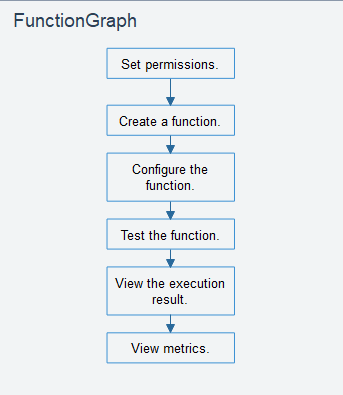
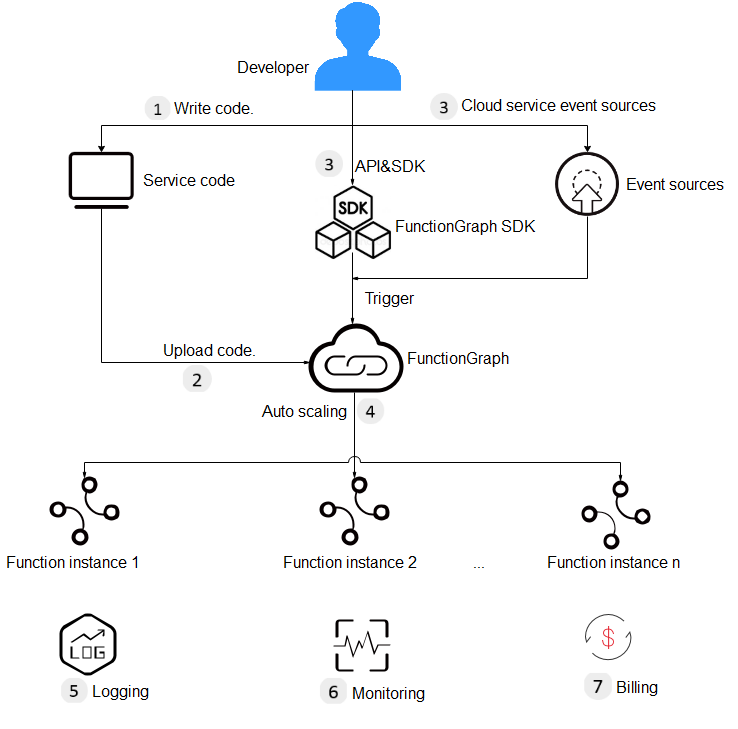

= IV - FaaS com a nuvem Huawei

== Visão Geral

A Huawei oferece uma solução FaaS via serviço/framework interno FunctionGraph, que faz parte da nuvem Huawei Cloud.

O FunctionGraph permite que desenvolvedores executem código em resposta a eventos sem a necessidade de provisionar ou gerenciar servidores, seguindo o modelo serverless.

Use a CLI oficial da Huawei para fazer *deploy* de funções serverless (FunctionGraph).

Processo e esquema de uso:

== Características do FunctionGraph

* Execução baseada em eventos:
Suporta gatilhos como chamadas HTTP (API Gateway), mudanças em banco de dados, mensagens de fila (DIS, Kafka etc.), armazenamento (OBS-Object Storage) e outros.
* Suporte a várias linguagens
* Permite executar funções personalizadas via container (com imagens Docker).
* Escalabilidade automática com base na demanda, sem necessidade de configuração manual.
* Gerenciamento e monitoração:
Suporte nativo para logs e métricas via Cloud Eye e AOM (Application Operations Management).
* Ambiente seguro e isolado:
Funções executadas em ambientes preemptivos, com controle de permissões via IAM (Identity and Access Management).
* Criação de APIs Serverless:
Pode ser integrado com API Gateway para construção de backends serverless.

=== Cenários / casos de uso comuns:

* Processamento de arquivos e de fluxo de dados em tempo real
* Criação de microserviços serverless
* Execução de tarefas em *background*: rotinas, páginas web/aplicativos, chatbots e back-ends para front-ends (BFF)
* Automações e integrações baseadas em eventos
* Webhooks e APIs
* Aplicativos de IA com serviços de EI, inferência de IA e reconhecimento de placas

== Integrações

Integra com serviços como:

* OBS (Object Storage)
* SMN (Simple Message Notification)
* DMS (Data Management Service)
* Cloud Eye (monitoramento), entre outros.

O FunctionGraph permite funções avançadas com acesso a banco de dados, filas, processamento de arquivos etc.

== Exemplo prático: Criar e implantar uma função simples (em Python)

1. Acesse o Console Huawei Cloud: https://console.huaweicloud.com/functiongraph
2. Faça login na sua conta.
3. Crie uma função:
** Nome da função: `hello_function`
** Ambiente de execução: Python 3.x
** Tipo de execução: Função com API Gateway (HTTP trigger) ou Função comum
** Região: selecione sua região preferida

4. No editor da Huawei Cloud, cole o seguinte código:

[source,python]
----
def handler(event, context):
    name = event.get("name", "mundo")
    return {
        "statusCode": 200,
        "isBase64Encoded": False,
        "headers": {"Content-Type": "application/json"},
        "body": f"Olá, {name}!"
    }
----

5. Teste a função:
** Vá até a aba *Teste*
** Insira um evento de teste:

[source,json]
----
{
  "name": "João"
}
----

** Clique em Executar. A saída será algo como:

[source,json]
----
{
  "statusCode": 200,
  "body": "Olá, João!"
}
----

6. (Opcional) Expor como uma API:
** Adicione gatilho via API Gateway
** Configure um endpoint e método (GET, POST)
** Após publicado, haverá uma URL pública para a função
